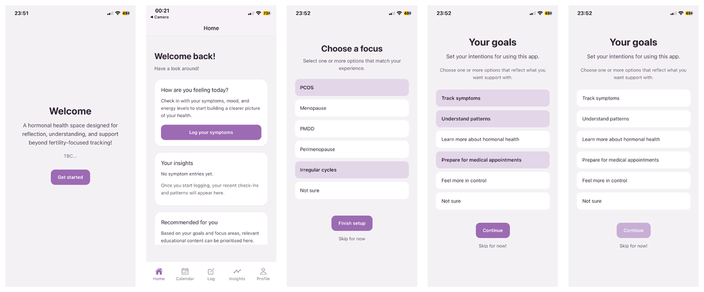
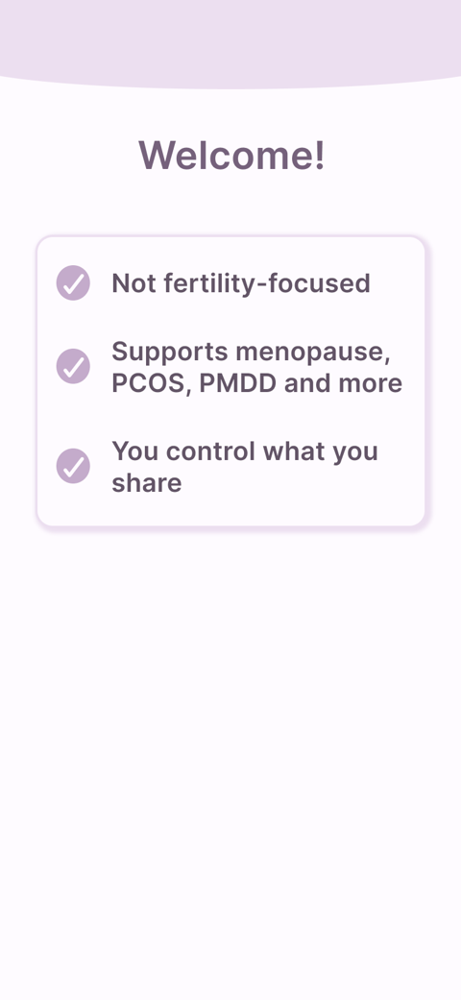
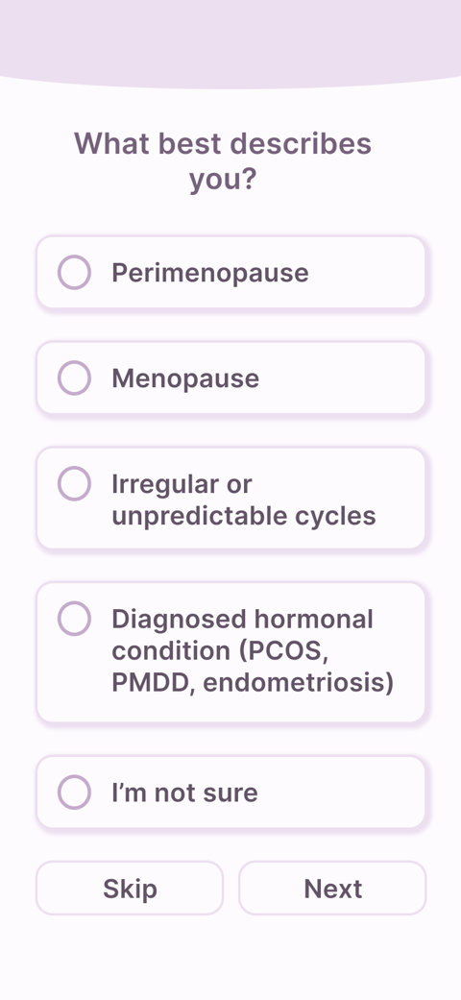
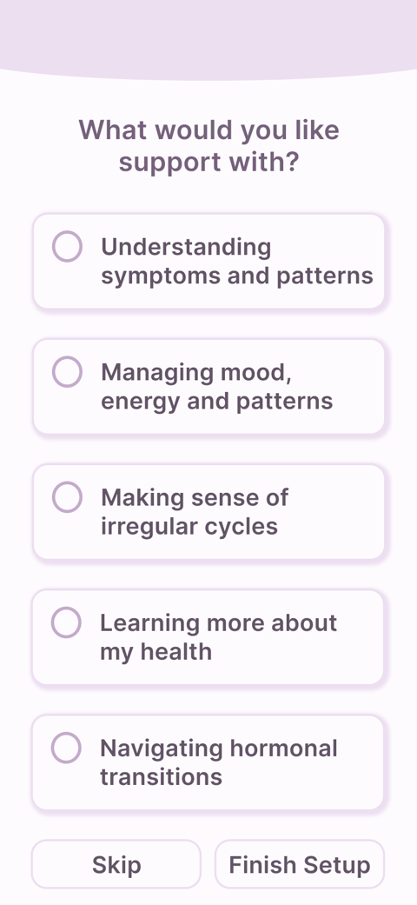
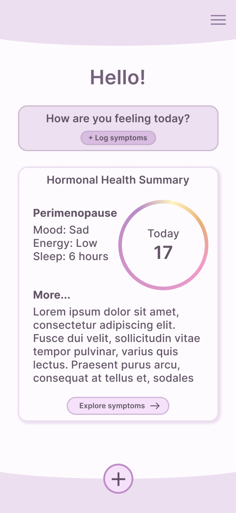

# Hormone+

*A mobile health tracking app for people underserved by fertility-focused FemTech. It supports unpredictable cycles, hormone-related conditions and personalised understanding, without paywalls.*




**Final-year project**, BSc Computer Science, Kingston University (2026)<br>
**My role:** research, UX design and React Native development (solo)<br>
**Try the intended design:** [interactive prototype ↗](https://zeynah-khan.github.io/portfolio/prototypes/hormone-prototype.html)

---

## Contents

- [Background](#background)
- [Research](#research)
- [Design](#design)
- [Features](#features)
- [Tech stack](#tech-stack)
- [Getting started](#getting-started)
- [Testing](#testing)
- [Limitations and next steps](#limitations-and-next-steps)

---

## Background

Most period and hormone tracking apps are built around **fertility prediction and regular cycles**. That works for some people, but it assumes a consistency that many don't have.

People with **PMDD, PCOS, perimenopause or menopause** often have irregular or unpredictable cycles and symptoms that change over time. Mainstream apps tend to put ovulation and pregnancy planning first. Features for menopause and other non-fertility needs often sit behind a **premium paywall**, which shuts out people who may already struggle to find good information and support.

Hormone+ puts **understanding before prediction**. Instead of forecasting your next period, it helps you log how you feel, notice patterns over time and read clear information that matches what you want support with.

---

## Research

I used three sources so that no single one would shape the findings on its own:

- **Literature review.** I read Feminist HCI (Bardzell, 2010), Cognitive Load Theory (Sweller, 1988) and work on the privacy risks of menstrual data, from Flo's 2019 data-sharing case to the concerns raised after Roe v. Wade was overturned.
- **Survey.** 12 people aged 20–60 responded, with a range of goals, frustrations and hormonal conditions.
- **Thematic analysis.** I grouped unprompted posts about apps like Clue and Flo on r/Periods and r/PCOS into recurring themes.

| Survey question | Result (12 responses) |
|---|---|
| How well do existing apps reflect your lived experience? | **0** said "very well" (3 somewhat, 4 neutral, 2 poorly, 3 not at all) |
| How do fertility-focused features impact your experience? | **6** said "irrelevant" (2 helpful, 1 neutral, 3 other) |

**What I found**

- **Apps are built for a "default" user.** Across all three sources, people outside the regular-cycle, fertility-focused norm felt the apps weren't made for them.
- **Language causes anxiety.** Words like "irregular", "abnormal" and "late" made people feel something was wrong with them.
- **Mood, energy, sleep and brain fog are under-supported.** These were among the most common symptoms, yet apps treat them as secondary.
- **Too much information overwhelms.** Dense graphs and medical jargon confused more than they helped.

Survey respondents described existing apps as *"not designed for me"*, *"clinical"* and *"infantilising"*.

---

## Design

I turned the findings into 10 requirements (5 functional, 5 non-functional) and prioritised them with MoSCoW. They led to these design principles:

- **Reflection, not prediction.** There are no cycle forecasts and no predictive notifications.
- **No cyclical imagery.** Circles and cycle wheels quietly assume a regular cycle, which is the very assumption the research flagged. Hormone+ uses cards instead.
- **Low cognitive load.** The app uses a clear hierarchy, small chunks of information and progressive disclosure, with more detail behind "Learn more".
- **Inclusive, non-judgemental language.** Nothing is framed as abnormal or late.
- **Room for uncertainty.** Every onboarding question has an "I'm not sure" option, and onboarding can be skipped entirely.
- **No paywalls** on essential health information.

<p align="center">
  
  
  
  
</p>

<p align="center"><sub>Early wireframes: Welcome, About you, Goals and Home. The circular day counter on Home was later replaced with cards, in line with the no-cyclical-imagery principle.</sub></p>

---

## Features

The app has five screens (**Home, Calendar, Log, Insights and Profile**) linked by a bottom navigation bar.

- **Personalised onboarding.** You choose a focus (PCOS, PMDD, perimenopause, menopause, irregular cycles or "not sure") and your goals, such as tracking symptoms, understanding patterns or preparing for medical appointments. These choices decide which insights and learning content you see first. You can skip onboarding and the app still works.
- **Symptom logging.** You can log physical, emotional and cognitive symptoms, including mood, pain, sleep and energy. The list also covers symptoms other apps often leave out, like hot flushes and brain fog. Symptoms are tappable pills, and you can add a written note.
- **Calendar.** Saved logs appear on the calendar, where you can edit or delete them.
- **Insights.** Rule-based summaries and patterns are generated from your logs and goals. Before you've logged anything, a friendly prompt helps you get started.
- **Learn more.** Short educational cards explain hormonal changes in plain language. They're ordered by your focus areas, and more detail opens in a pop-up.
- **A check-in, not a dashboard.** Home opens with "How are you feeling today?" and short card summaries instead of dense charts.
- **Private by default.** Everything is stored locally on your device. There are no accounts and no cloud storage.

---

## Tech stack

| Area | Details |
|---|---|
| Framework | React Native (JavaScript) |
| Tooling | Expo, Expo Go, Visual Studio Code |
| Design | Figma |
| Data | On-device local storage |
| Insights | Rule-based logic driven by logs and onboarding choices |

**Structure.** The app is component-based. Shared layout and styling live in reusable components and theme files, which keeps the look consistent and cuts down on repeated code. Symptom and onboarding data are kept in shared structures, so one selection can update several screens.

**Decisions along the way.**
- **Local storage over accounts and a backend.** This kept the scope manageable, and it means sensitive health data stays on the phone.
- **Rule-based insights over APIs or AI.** I explored API and AI-driven insights, but suitable health APIs were limited, so I chose simple, reliable rules to keep the app stable.
- **Fewer Expo libraries.** Some libraries caused compatibility problems and build errors, so I dropped or reworked those features.

---

## Getting started

You'll need [Node.js](https://nodejs.org/) and the **Expo Go** app on your phone ([iOS](https://apps.apple.com/app/expo-go/id982107779) / [Android](https://play.google.com/store/apps/details?id=host.exp.exponent)).

Clone this repo, then from the project folder run:

```bash
npm install
npx expo start
```

Scan the QR code with the Camera app on iOS, or from inside Expo Go on Android.

---

## Testing

**Functional testing: 12 of 12 tests passed.** The tests covered onboarding (including skipping), logging, editing and deleting logs, and insights. Incomplete inputs, like skipped onboarding or an empty log, were handled without errors.

<details>
<summary>See all 12 tests</summary>

| Feature | Test | Expected result | Result |
|---|---|---|---|
| Onboarding | Skip entirely | App remains usable without personalisation | ✅ |
| Onboarding | Select focus areas but skip goals | Partial personalisation still applied | ✅ |
| Onboarding | Skip focus areas but select goals | Selected goals are reflected in insights | ✅ |
| Onboarding | Select focus areas and goals | Fully personalised Home and Insights | ✅ |
| Symptom logging | Select and unselect symptoms | UI updates to match the selection | ✅ |
| Symptom logging | Select and save a log | Log saves and updates the calendar | ✅ |
| Symptom logging | Save without selecting symptoms | Error message shown | ✅ |
| Symptom logging | Save with only a text note | Saved as a text-only log | ✅ |
| Edit log | Open and change a log | Changes are saved and shown | ✅ |
| Delete log | Open and delete a log | Log is removed from the calendar | ✅ |
| Insights | No logs saved yet | Default message encourages tracking | ✅ |
| Insights | After saving a log | Patterns and summaries match the user's choices | ✅ |

</details>

**Usability testing: 5 informal sessions**, three of them with people from the original survey. Everyone moved between screens without guidance and found logging symptoms intuitive. The most common feedback was that the interface felt *too* minimal, and some people wanted graphs.

**Requirements: 7 of 10 fully met, 3 partially.**

<details>
<summary>See the requirements</summary>

| # | Requirement | Met? |
|---|---|---|
| FR1 | Track a wide range of symptoms beyond menstrual flow | Partially: relevant, but the range wasn't widened much |
| FR2 | Support tracking without fertility goals or cycle regularity | ✅ Yes |
| FR3 | Interpretive summaries of symptoms over time | Partially: rule-based, not advanced |
| FR4 | Let users define personal goals | ✅ Yes |
| FR5 | Educational content in clear, accessible language | ✅ Yes |
| NFR1 | Minimise cognitive load (hierarchy, chunking, progressive disclosure) | ✅ Yes |
| NFR2 | Inclusive, non-judgemental language | ✅ Yes |
| NFR3 | Accessible to all levels of digital and health literacy | ✅ Yes |
| NFR4 | Transparency and trust in data handling | Partially: local storage only |
| NFR5 | No constant alerts or predictive notifications | ✅ Yes |

</details>

---

## Limitations and next steps

Under dissertation time pressure, the built app ended up closer to default styling than the warmer design I'd planned. The [interactive prototype](https://zeynah-khan.github.io/portfolio/prototypes/hormone-prototype.html) shows what the design was aiming for.

Next steps:

- [ ] Bring the prototype's visual design into this codebase
- [ ] Add optional graph views for people who prefer visuals, without making them the default
- [ ] Add encrypted, user-controlled storage so data can move across devices
- [ ] Add data export for medical appointments, plus a dark mode
- [ ] Run structured testing over several weeks to see how people use it long term

---

## About me

I'm **Zeynah Khan**, a UX designer and developer in London. I researched, designed and built this app on my own for my final-year project.

[Portfolio](https://zeynah-khan.github.io/portfolio/) · [LinkedIn](https://www.linkedin.com/in/zeynah-khan)
